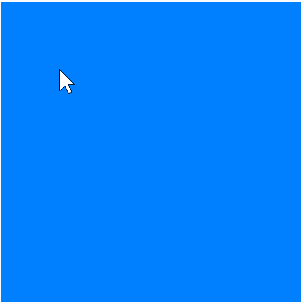

# jili0934_9103_Tut07_GroupE_User_Input
9103_Creative coding major project_Tut07_GroupE_User Input_jili0934

---

#### Group E - User Input

---

### 1. Instructions on how to interact with the work.
- Open the folder in Visual Studio Code.
- Right click on the index.html to open the file with Live Server.
1. Click anywhere on the canvas to change a random colour for each blob.
2. Click on the canvas to create a ripple effect at the mouse position.
3. Press the UP ARROW key to increase the size of the blobs.
4. Press the DOWN ARROW key to reduce the size of the blobs.

---

### 2. Details of your individual approach to animating the group code.
**User Input: Incorporate mouse or keyboard inputs for animation.**

I focus on user input to create interactive animations that respond directly to the user’s action.

**mousePressed interaction:**
- Each blob changes to a random colour every time the user clicks on the canvas.
- A ripple effect appears wherever the mouse is pressed.

**keyboardPressed interaction:**
- Pressing the UP_ARROW increases the size of the blobs.
- Pressing the DOWN_ARROW reduces the size of the blobs.

These features make my animation different from other group members. While other group members have focused on perlin noise, audio and time-based animations, my animation focused on the user’s interaction with the artwork through mouse and keyboard control.

---

### 3. References to inspiration for animating your individual code.
### Visual Inspiration

**Figure 1.** Screenshot from the group artwork

The inspiration for the mouse ripple effect came from the circle patterns in the centre of each blob from our group artwork. These circle outlines reminded me of water ripples, which share a similar layered and expanded form.

**Figure 2.** Water ripples

---

### Code Inspiration
- **funtion mousePressed()**

The function **mousePressed()** was sourced from the p5.js website. This function allows users to interact with the artwork by **clicking** on the canvas. In my project,  I used this function for the **ripple effect** and a **random colour change** applied to all blobs with each click.

- **mouse ripple**

The ripple effect that appears on the canvas when the user presses the mouse is inspired by Happy Coding. Happy Coding demonstrated how to create a ripple effect based on the function **mousePressed()** with **circle()**. I chose to use this code because it provides a direct response when a user clicks on the canvas. The ripple effect is also well integrated into the artwork.

**Figure 3** Happy Coding: mouse ripple effect

- **function keypressed()**

The function **keyPressed()** allows users to interactively control the size of the blobs using the keyboard. When the **UP ARROW** key is pressed, the base radius **(rBase)** of each blob **increases** by 5 units, making the blobs appear larger. Conversely, when the **DOWN ARROW** key is pressed, the base radius **decreases** by 5 units, making the blobs smaller. 

- **function windowResized()**

The function **windowResized()** is used to ensure all visual elements continue to display correctly regardless of screen size changes. It recalculates the scale and canvas size by calling **calculateScale()** and **resizeCanvas()**, so the artwork adjusts fluidly to the new screen dimensions. 

---

### 4. Reference list
Bella. (n.d.). *Water Ripple.* [Watercolour]. Pinterest. https://au.pinterest.com/pin/211174978071095/ 

Happy Coding. (n.d.). *Mouse Ripple.* https://happycoding.io/tutorials/p5js/input/mouse-ripple

Happy Coding. (n.d.). *Mouse Ripple.* [GIF]. Happy Coding. https://happycoding.io/tutorials/p5js/input/mouse-ripple 

P5.js (n.d.). *mousePressed().* https://p5js.org/reference/p5/mousePressed/ 

p5.js (n.d.). *windowResized().* https://p5js.org/reference/p5/windowResized/
